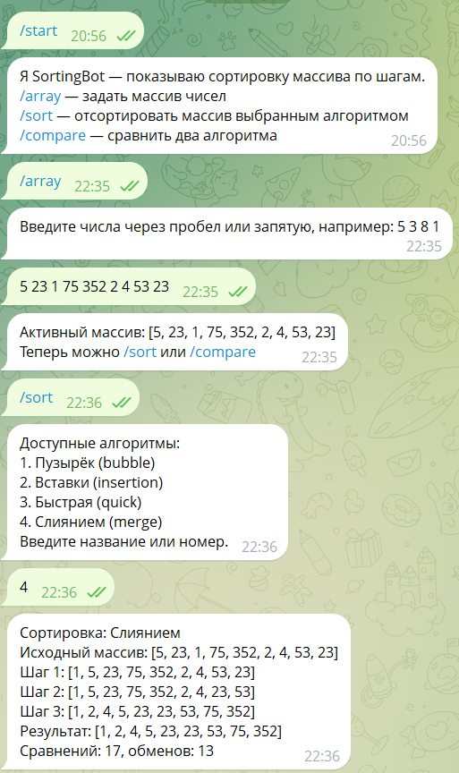
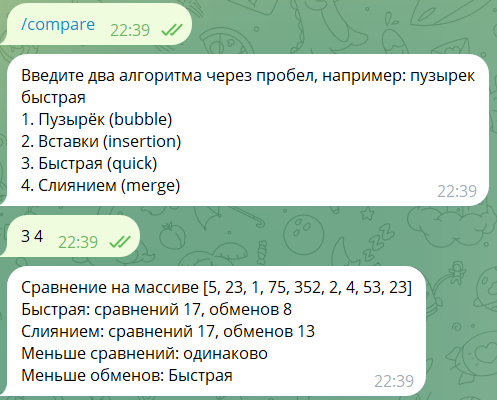

# SortingBot

Telegram-бот для пошаговой визуализации и сравнения алгоритмов сортировки. Пользователь задаёт массив чисел, выбирает алгоритм и видит состояние массива после каждого шага. Также бот сравнивает два алгоритма по количеству сравнений и обменов.

Доступные алгоритмы: пузырёк, вставки, быстрая, слиянием.

## Команды

- `/array` — задать массив (от 2 до 10 чисел через пробел или запятую), он становится активным.
- `/sort` — показать список алгоритмов, затем отсортировать активный массив выбранным алгоритмом пошагово.
- `/compare` — сравнить два алгоритма на активном массиве, например: `пузырек быстрая`.
- `/help` — список команд.

Каждая команда работает как конечный автомат: бот запоминает состояние пользователя (ждёт массив, ждёт алгоритм, ждёт два алгоритма). Состояние хранится отдельно для каждого пользователя.

## Запуск

1. Установите зависимости:
   ```sh
   npm install
   ```
2. Создайте файл `.env` по образцу `.env.example` и укажите токен бота от @BotFather:
   ```
   TELEGRAM_BOT_TOKEN=ваш_токен
   ```
3. Запустите бота:
   ```sh
   npm run start
   ```

Проверки:

```sh
npm run lint
npm run test
npm run test:coverage
```

## Примеры работы

Задание массива и пошаговая сортировка:



Сравнение алгоритмов:


